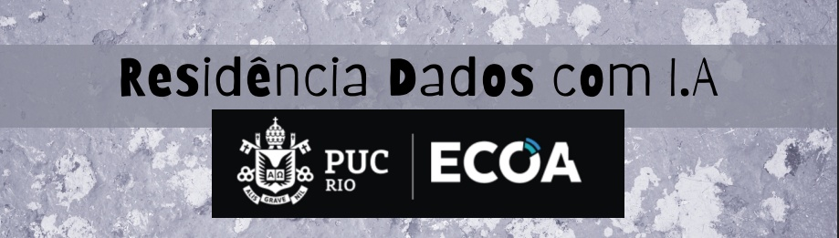

A **Residência em Dados com Inteligência Artificial** é um programa imersivo promovido pela **PUC-Rio** em parceria com a **ECOA**. Possui como objetivo capacitar profissionais para transformar grandes volumes de dados em decisões estratégicas, combinando fundamentação teórica sólida com práticas hands-on aplicadas ao mercado.

---

## Objetivos de Aprendizado ⤵

-  **Análise Exploratória e Diagnóstico de Dados:** Identificação de padrões, tendências e comportamentos em dados corporativos.
- **Storytelling com Dados:** Construção de narrativas visuais eficazes inspiradas na metodologia de Cole Nussbaumer Knaflic 
- **Visualização Avançada e Interativa:** Criação de dashboards e gráficos de alto impacto com **Plotly**.
- **Comunicação Executiva:** Integração de análises técnicas com artefatos de apresentação em alta definição (PDFs interativos e apresentações executivas).
- **Inteligência Artificial & Machine Learning:** Aplicação de algoritmos inteligentes para solução de problemas complexos.

---

## ✎ Jornada de Aprendizado & Diário de Bordo 

| Módulo / Aula | Tema Principal | Principais Ferramentas & Conceitos | Entrega / Artefato |
| :--- | :--- | :--- | :---: |
| **Aula 01 / Projeto 01** | Diagnóstico Executivo & Storytelling | Python, Pandas, Plotly, Storytelling | [Ver Detalhes](https://github.com/Vitoriabbc1/dataia/blob/main/Aula_1/aula1_dataia.ipynb) |
| **Aula 02** | *[Em breve]* | *[Ferramentas]* | ⏳ |

---

### ▁ ▂ ▃ ▄ ▅ ▆ ▇ █ ▉ ▊ ▋ Aula 01 | Projeto: Diagnóstico Executivo de Projetos

<b>🔍 Clique aqui para ver o resumo completo da Aula 01 e do desenvolvimento do projeto</b>

 

#### ☇ O Desafio 
* **Demanda Inicial:** Manipulação exploratória e integração a partir de 3 tabelas de dados fornecidas em aula.
* **Iniciativa & Evolução:** Após a recomendação do professor sobre a obra *"Storytelling com Dados"* (Cole Nussbaumer Knaflic), a análise foi expandida de um tratamento básico para uma entrega analítica e executiva focada em tomada de decisão.

#### ✅ O que foi desenvolvido e aprendido: ✅
1. **Manipulação & Engenharia de Dados:**
   - Tratamento de datas e cálculo de tempo de contrato/antiguidade de clientes.
   - Agregação de faturamento por marca parceira.
2. **Visualização & Storytelling no Plotly:**
   - Aplicação de técnicas de *declutter* (remoção de linhas de grade, eixos redundantes e poluição visual).
   - Destaque focado em dados críticos usando paletas neutras e destaques pontuais.
   - Renderização estática garantida no GitHub usando salvamento direto em imagens (`fig.write_image`).
3. **Comunicação Executiva:**
   - Estruturação de apresentação no Canva em alta definição.
   - Apresentação sequencial correta ordenada via código (`sorted` por chave numérica).
   - Criação de artefato com navegação interativa via PDF e link público.

#### 🔗 Links do Projeto
- 📓 **Notebook da Aula:** [Aula 1 - Notebook](https://github.com/Vitoriabbc1/dataia/blob/main/Aula_1/aula1_dataia.ipynb)
- 📊 **Apresentação Executiva (PDF):** [Storytelling das Informações](https://github.com/Vitoriabbc1/dataia/blob/main/Aula_1/apresenta%C3%A7%C3%A3o.pdf) 

---
